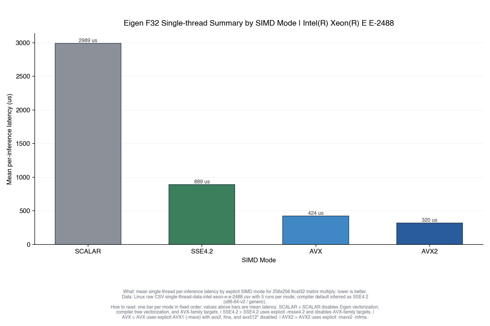
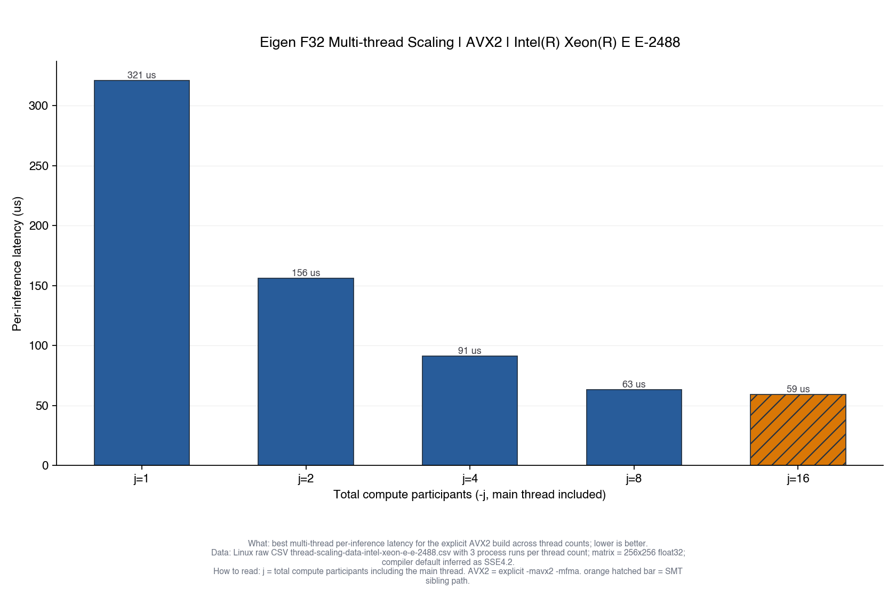
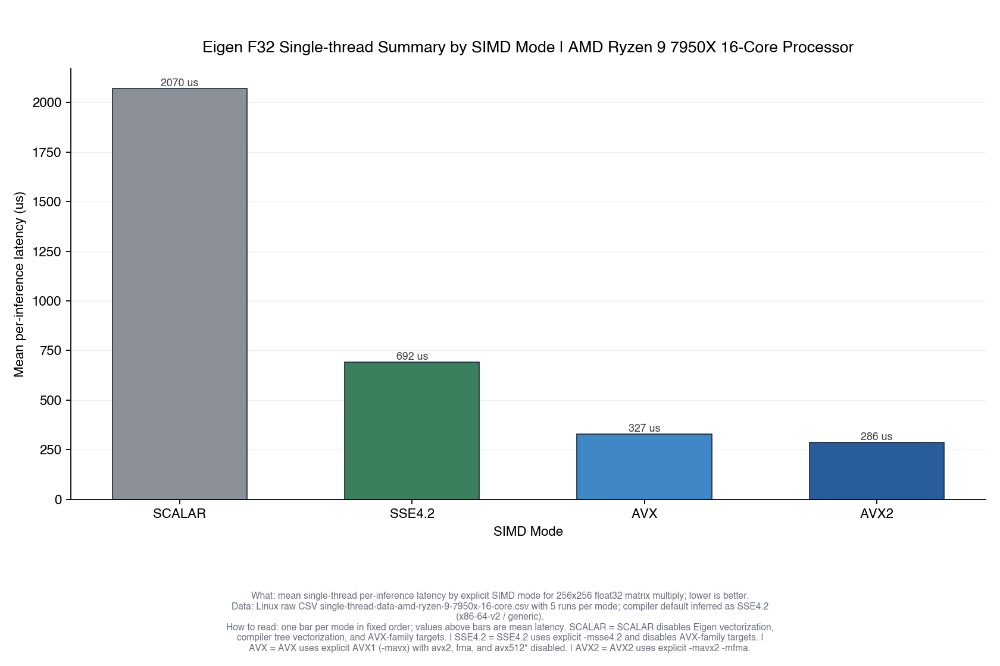
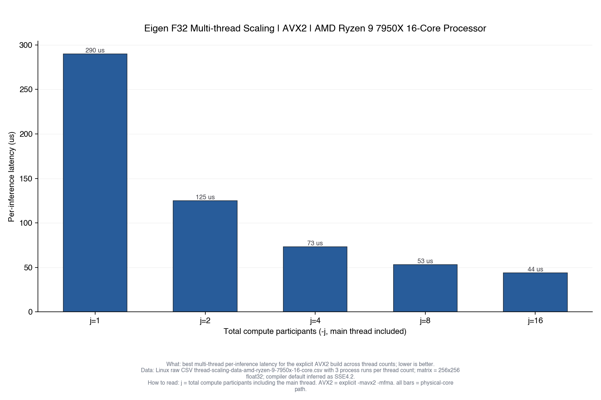

# matrix-inference-test

## 测什么

这个项目测试 `256x256 float32` 矩阵乘法在单线程和多线程场景下的延迟表现。

当前包含两类 benchmark：

- `eigen-f32-single-thread/`
  - 单线程 Eigen `float32 256x256` 矩阵乘法
  - 显式支持四种编译模式：`scalar`、`sse42`、`avx128`、`avx256`
  - 权重矩阵在初始化阶段生成一次
  - 输入特征在启动时预先生成一批，每个 inference loop 使用一张矩阵
  - 主指标是单次 inference 延迟 `per_inference_us`
- `eigen-f32-multi-thread/`
  - 多线程 Eigen `float32 256x256` 推理式 benchmark
  - 显式支持四种编译模式：`scalar`、`sse42`、`avx128`、`avx256`
  - 主线程持有当前输入 tensor，并参与计算
  - 权重矩阵在初始化阶段按输出列切分为静态 shard
  - `-j` 表示总计算参与者数量，包含主线程
  - 线程数按运行环境自动发现，使用 2 的幂递增直到逻辑 CPU 上限
  - SMT/超线程路径也是运行时自动检测

## 当前结果

以下结果按 CPU 型号归档。

补充说明：

- 两台验证机器上的 hosted compiler default 都推断为 `-march=x86-64-v2`、`-mtune=generic`、SIMD level `SSE4.2`，因此显式 `SSE4.2` 模式可以直接和当前 hosted compiler 默认路径对照。
- `SCALAR` 是强制标量基线：关闭 Eigen vectorization，同时关闭 compiler tree vectorization 和 AVX-family target。
- `AVX` 在这个 repo 里表示显式 AVX1：`-mavx`，同时保持 `avx2`、`fma`、`avx512*` 关闭。
- README 只放汇总表和 PNG。单线程重复明细与原始 CSV 放到详细结果文档和 `docs/results/`。
- 最终发布到 `docs/results/` 的 PNG 由本地 Python 发布脚本从收集回来的 CSV + metadata 渲染，不再依赖远端 `gnuplot`。
- 发布 PNG 使用带内容哈希的文件名，publish 脚本会自动重写 README / docs 中的图片引用并删除同一图表的旧版本，避免 GitHub `Code` 页图片缓存不刷新。

### Intel Xeon E-2488

单线程：

| 指标 | `SCALAR` | `SSE4.2` | `AVX` | `AVX2` |
|---|---:|---:|---:|---:|
| 均值 | 2989 us | 889 us | 424 us | 320 us |



多线程：

| `-j` | `SCALAR` | `SSE4.2` | `AVX` | `AVX2` |
|---|---:|---:|---:|---:|
| 1 | 3012 us | 888 us | 425 us | 321 us |
| 2 | 1514 us | 433 us | 203 us | 157 us |
| 4 | 773 us | 233 us | 114 us | 91 us |
| 8 | 385 us | 127 us | 74 us | 63 us |
| 16 | 417 us | 125 us | 72 us | 59 us |



### AMD Ryzen 9 7950X 16-Core Processor

单线程：

| 指标 | `SCALAR` | `SSE4.2` | `AVX` | `AVX2` |
|---|---:|---:|---:|---:|
| 均值 | 2070 us | 692 us | 327 us | 286 us |



多线程：

| `-j` | `SCALAR` | `SSE4.2` | `AVX` | `AVX2` |
|---|---:|---:|---:|---:|
| 1 | 2088 us | 692 us | 327 us | 288 us |
| 2 | 1052 us | 315 us | 132 us | 125 us |
| 4 | 544 us | 171 us | 77 us | 73 us |
| 8 | 311 us | 101 us | 55 us | 53 us |
| 16 | 185 us | 72 us | 51 us | 44 us |



更详细的结果，见：

- [docs/benchmark-results.md](docs/benchmark-results.md)
- 原始 CSV：
  - `docs/results/single-thread-data-intel-xeon-e-e-2488.csv`
  - `docs/results/thread-scaling-data-intel-xeon-e-e-2488.csv`
  - `docs/results/single-thread-data-amd-ryzen-9-7950x-16-core.csv`
  - `docs/results/thread-scaling-data-amd-ryzen-9-7950x-16-core.csv`
- 配套 metadata JSON：
  - `docs/results/single-thread-meta-intel-xeon-e-e-2488.json`
  - `docs/results/thread-scaling-meta-intel-xeon-e-e-2488.json`
  - `docs/results/single-thread-meta-amd-ryzen-9-7950x-16-core.json`
  - `docs/results/thread-scaling-meta-amd-ryzen-9-7950x-16-core.json`

## 如何重跑

环境要求：

- 远端 benchmark 运行环境：
- Linux x86_64
- `g++`
- `cmake`
- `ninja`
- `curl` 或 `wget`
- `unzip`
- 本地发布环境：
  - Python 3
  - `matplotlib`
  - `pandas`
  - `numpy`

### 1. 下载 Eigen

```bash
./download-eigen.sh
```

### 2. 运行单线程 benchmark

单次运行：

```bash
cd eigen-f32-single-thread
make SIMD_MODE=avx256
```

整套运行：

```bash
cd eigen-f32-single-thread
./run-benchmark-suite.sh
```

输出文件：

- `reports/single-thread-data.tsv`
- `reports/single-thread-data-<cpu-slug>.csv`
- `reports/single-thread-meta-<cpu-slug>.json`
- `reports/single-thread-report-<cpu-slug>.md`

### 3. 运行多线程 benchmark

单次运行，例如 `-j 8`：

```bash
cd eigen-f32-multi-thread
make SIMD_MODE=avx256 THREADS=8
```

整套运行：

```bash
cd eigen-f32-multi-thread
./run-benchmark-suite.sh
```

输出文件：

- `reports/thread-scaling-data.tsv`
- `reports/thread-scaling-data-<cpu-slug>.csv`
- `reports/thread-scaling-meta-<cpu-slug>.json`
- `reports/thread-scaling-report-<cpu-slug>.md`

### 4. 在本地发布环境生成 PNG

先把原始 `reports/` 目录同步回本地任意 cache 目录，然后把这些目录作为 `--report-dir` 传给渲染脚本：

```bash
./scripts/render-published-results.sh \
  --report-dir /path/to/host-a/eigen-f32-single-thread/reports \
  --report-dir /path/to/host-a/eigen-f32-multi-thread/reports \
  --report-dir /path/to/host-b/eigen-f32-single-thread/reports \
  --report-dir /path/to/host-b/eigen-f32-multi-thread/reports
```

输出文件：

- `docs/results/single-thread-summary-<cpu-slug>-<artifact-hash>.png`
- `docs/results/thread-scaling-avx2-<cpu-slug>-<artifact-hash>.png`
- `docs/results/*data-<cpu-slug>.csv`
- `docs/results/*meta-<cpu-slug>.json`

说明：

- suite 会按 `scalar`、`sse42`、`avx128`、`avx256` 四种编译模式分别跑完整套测试。
- 当前两台验证机器上的 hosted compiler default 都推断为 `SSE4.2`，因此显式 `sse42` 模式可以直接作为该默认路径的对照。
- `avx128` 表示显式 AVX1：`-mavx`，同时关闭 `avx2`、`fma`、`avx512*`。
- 远端 benchmark suite 只负责生成原始 CSV、metadata JSON 和详细 markdown 报告；最终 PNG 统一在本地发布环境中渲染。
- 本地同步回来的原始 `reports/` 建议放在 repo 外部 cache 目录，而不是放回 GitHub repo 工作树。
- publish 脚本会为 PNG 生成新的内容哈希后缀，并自动更新 `README.md` 与 `docs/benchmark-results.md` 中的图片路径。
- 如果当前 CPU 不支持某个模式，该模式会在报告中标为 `unsupported`，而不是静默跳过。
